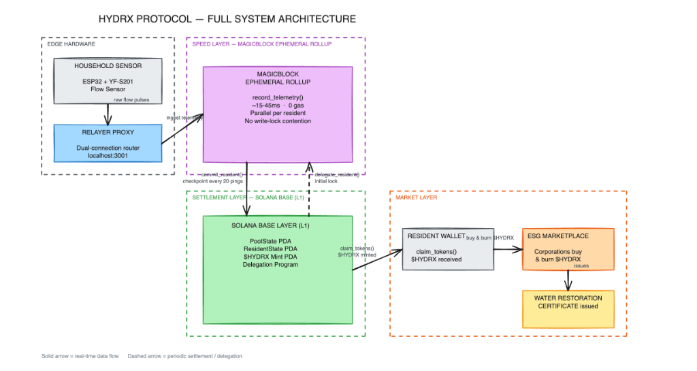
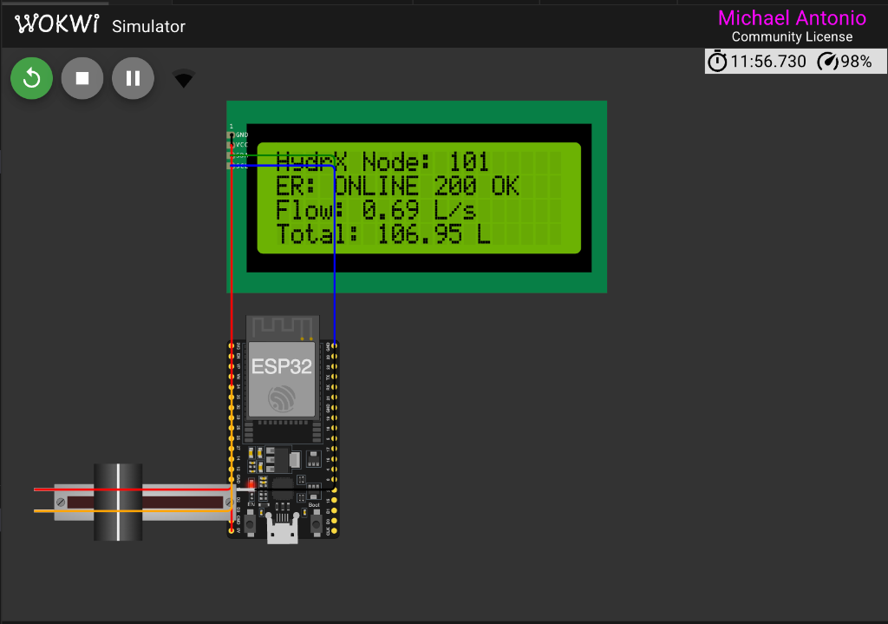

# HydrX Protocol on MagicBlock Ephemeral Rollups
### High-Throughput, Sub-50ms Verifiable Water Conservation DePIN on Solana

---

## Table of Contents

1. [Executive Summary](#1-executive-summary)
2. [Project Directory Structure (A to Z Map)](#2-project-directory-structure-a-to-z-map)
3. [Core Protocol Architecture & Deployed Addresses](#3-core-protocol-architecture--deployed-addresses)
   - 3.1 Full System Architecture Diagram
   - 3.2 Architectural Flow & 4-Layer Data Transmission Model
   - 3.3 Deployed Addresses & Network Endpoints
4. [Prerequisites & Toolchain Setup](#4-prerequisites--toolchain-setup)
5. [Local Setup & Installation Step-by-Step](#5-local-setup--installation-step-by-step)
   - 5.1 Clone & Install All Sub-Packages
   - 5.2 Wallet Keypair Setup & Devnet Funding
6. [Master Runbook: How to Run the Entire Stack Locally](#6-master-runbook-how-to-run-the-entire-stack-locally)
   - 6.1 One-Command Instant Launch (`./start.sh` or `npm start`)
   - 6.2 Service Terminator (`./stop.sh`)
   - 6.3 Component 1: Dual-Connection Zero-Gas Relayer Proxy (`localhost:3005`)
   - 6.4 Component 2: Interactive Real-Time Performance Dashboard (`localhost:4005`)
   - 6.5 Component 3: Next.js Frontend Web Application (`localhost:3000`)
   - 6.6 Component 4: ESP32 IoT Smart Meter Firmware & Wokwi Simulator
   - 6.7 Component 5: Multi-Node High-Frequency IoT Simulator
   - 6.8 Component 6: Anchor Smart Contract Build & Test Suite
7. [Comprehensive Guide to Every Frontend Page & Tab](#7-comprehensive-guide-to-every-frontend-page--tab)
   - 7.1 Landing Page & Protocol Visualizer (`/`)
   - 7.2 Resident Conservation Dashboard Tab
   - 7.3 IoT Hardware Lab Tab
   - 7.4 Community Conservation Leaderboard Tab
   - 7.5 $HYDRX Token Marketplace Tab
   - 7.6 Clean Water Impact & Donation Tab
   - 7.7 Architecture FAQ Tab
   - 7.8 Corporate ESG Water Offset Portal (`/corporate`)
8. [Interactive Ephemeral Rollup Control Deck Guide](#8-interactive-ephemeral-rollup-control-deck-guide)
   - Delegate Meter to ER
   - Commit Checkpoint to L1
   - Undelegate State
9. [Solana Explorer Verification Guide: ER vs. L1](#9-solana-explorer-verification-guide-er-vs-l1)
   - Verifying Ephemeral Rollup Transactions (0 SOL Fee, Sub-50ms)
   - Verifying Base Layer L1 Checkpoint Commits
   - Inspecting the Resident PDA State
10. [Performance Benchmarks: Solana L1 vs. MagicBlock ER](#10-performance-benchmarks-solana-l1-vs-magicblock-er)
11. [Troubleshooting & Common Questions](#11-troubleshooting--common-questions)
12. [Cloud Hosting & Production Deployment (Vercel & Render/Railway)](#12-cloud-hosting--production-deployment-vercel--renderrailway)
   - 12.1 Why Are Frontend, Relayer, and Simulator in Separate Folders?
   - 12.2 Hosting the Frontend Web App on Vercel
   - 12.3 Hosting the Relayer Proxy on Render / Railway
   - 12.4 Standalone CyberDeck Monitor on Vercel (`/cyberdeck`)

---

## 1. Executive Summary

**HydrX Protocol** is a decentralized physical infrastructure network (DePIN) transforming domestic freshwater conservation into tokenized **Water Benefit Certificates ($HYDRX)** on Solana.

Traditional blockchain architectures fail when tasked with ingesting continuous high-frequency telemetry from thousands of residential IoT flow meters:
1. **Account Lock Contention**: All incoming flow pulses write-lock shared network PDAs, serializing transactions and choking slot throughput.
2. **Prohibitive Gas Costs**: Paying transaction fees on millions of daily micro-pulses is economically unsustainable.
3. **RPC Throttling**: Public RPC endpoints throttle IoT device traffic with HTTP 429 errors.

**The Solution:** HydrX leverages **MagicBlock Ephemeral Rollups (ER)**. Residential meter accounts are delegated into dedicated, high-speed Ephemeral Rollup validators. Telemetry pings execute in **sub-50ms** with **0 gas fees** and **zero write-lock contention**, while atomic state checkpoints periodically commit verified water savings and rewards back to Solana Base Layer (L1).

---

## 2. Project Directory Structure (A to Z Map)

```text
magicblockz/
├── programs/
│   └── hydrx_magic/               # Anchor Smart Contract
│       ├── Cargo.toml
│       └── src/
│           ├── lib.rs             # Core logic: #[delegate], record_telemetry, commit_resident, undelegate_resident
│           └── errors.rs          # Custom protocol error codes
├── tests/
│   └── hydrx_magic.ts             # Complete Anchor mocha test suite
├── relayer/                       # Dual-Connection Zero-Gas Relayer Proxy
│   ├── package.json
│   ├── server.js                  # Express API routing between Solana L1 and MagicBlock ER
│   ├── Dockerfile                 # Container image specification for cloud deployment
│   └── render.yaml                # Render.com blueprint configuration
├── dashboard/                     # Real-Time Monitoring & Interactive Control Deck
│   ├── package.json
│   ├── server.js                  # Static asset server (port 4005) with no-cache headers
│   └── public/
│       ├── index.html             # High-tech cyber deck UI with side-by-side benchmarks
│       └── app.js                 # Polling logic, state transition handlers, live feed
├── frontend/                      # Next.js 15 Web Application (Vercel-ready)
│   ├── package.json
│   ├── next.config.ts
│   ├── vercel.json                # Vercel deployment configuration
│   ├── public/
│   │   ├── cyberdeck/             # Mirrored standalone performance cyber-deck UI
│   │   └── images/                # Brand, architecture, and simulator assets
│   └── src/
│       ├── app/
│       │   ├── page.tsx           # Main application shell with dynamic tab routing
│       │   ├── layout.tsx         # Global layout, fonts, Solana wallet providers
│       │   ├── globals.css        # Custom design system (glassmorphism, neon accents)
│       │   └── corporate/
│       │       └── page.tsx       # Dedicated Corporate ESG Water Offset Portal
│       └── components/
│           ├── Navbar.tsx         # Header navigation and wallet connector
│           ├── LandingView.tsx    # Hero section, value propositions, interactive visualizers
│           ├── DashboardTab.tsx   # Resident meter stats, token claim engine
│           ├── HardwareLabTab.tsx # Live IoT pulse monitor, sensor diagnostics
│           ├── LeaderboardTab.tsx # Gamified apartment complex rankings
│           ├── MarketplaceTab.tsx # $HYDRX Water Credit trading and order book
│           ├── DonationTab.tsx    # Community clean water project funding
│           ├── FaqTab.tsx         # Architectural FAQ and deep dive
│           └── SolanaMagicBlockVisualizer.tsx # Side-by-side latency comparator
├── iot-hardware/                  # Physical & Simulated IoT Hardware
│   ├── sketch.ino                 # ESP32 C++ firmware (Wi-Fi, Hall-effect pulse counting, HTTP client)
│   ├── diagram.json               # Wokwi circuit diagram (ESP32 + flow sensor + OLED + push button)
│   ├── wokwi.toml                 # Wokwi simulation configuration
│   └── platformio.ini             # PlatformIO build configuration
├── iot-simulator/                 # High-Frequency Multi-Node Node.js Simulator
│   ├── package.json
│   └── index.js                   # Simulates 8 parallel apartment nodes streaming pulses
├── assets/                        # Architecture diagrams and system schematics
│   ├── hydrx_system_architecture.png
│   └── wokwi_simulation_esp32.png
├── start.sh                       # Master one-command local stack launcher
├── stop.sh                        # Clean service shutdown utility
├── wallet-keypair.json.example    # Example keypair format for relayer signing
├── Anchor.toml                    # Anchor configuration (Devnet RPC, program IDs)
└── README.md                      # Complete system documentation (this file)
```

---

## 3. Core Protocol Architecture & Deployed Addresses

### 3.1 Full System Architecture Diagram



```text
+------------------------------------------------------------------------------------------------------------------------+
|                                        HYDRX PROTOCOL - FULL SYSTEM ARCHITECTURE                                       |
+------------------------------------------------------------------------------------------------------------------------+
|                                                                                                                        |
|  . - - - - - - - - - - - - - .       . - - - - - - - - - - - - - - - - - - - - - - - .                                 |
|  '       EDGE HARDWARE       '       '  SPEED LAYER - MAGICBLOCK EPHEMERAL ROLLUP    '                                 |
|  '                           '       '                                               '                                 |
|  '   +-------------------+   '       '   +---------------------------------------+   '                                 |
|  '   |  HOUSEHOLD SENSOR |   '       '   |     MAGICBLOCK EPHEMERAL ROLLUP       |   '                                 |
|  '   | ESP32 + YF-S201   |   '       '   |                                       |   '                                 |
|  '   | Flow Sensor       |   '       '   |  record_telemetry()                   |   '                                 |
|  '   +---------+---------+   '       '   |  ~15-45ms  |  0 gas                   |   '                                 |
|  '             | raw flow    '       '   |  Parallel per resident                |   '                                 |
|  '             | pulses      '       '   |  No write-lock contention             |   '                                 |
|  '             v             '       '   +------------------+--------------------+   '                                 |
|  '   +-------------------+   '       '                      |           ^            '                                 |
|  '   |   RELAYER PROXY   |   '       ' - - - - - - - - - - -|- - - - - -|- - - - - - '                                 |
|  '   | Dual-connection   |   '                              |           :                                              |
|  '   | router            |   '           commit_resident()  |           : delegate_resident()                          |
|  '   | localhost:3005    |---'---> ingest telemetry         |           : (initial lock)                               |
|  '   +-------------------+   '   (solid arrow: real-time)   |           :                                              |
|  . - - - - - - - - - - - - - .                              |           :                                              |
|                                                             v           :                                              |
|                              . - - - - - - - - - - - - - - -|- - - - - -:- - - - - - .       . - - - - - - - - - - - - - - - - - - - - - - - .
|                              '     SETTLEMENT LAYER - SOLANA BASE (L1)               '       '                 MARKET LAYER                  '
|                              '                                                       '       '                                               '
|                              '   +-----------------------------------------------+   '       '   +-----------------+   +-----------------+   '
|                              '   |            SOLANA BASE LAYER (L1)             |   '       '   | RESIDENT WALLET |   | ESG MARKETPLACE |   '
|                              '   |                                               |   '       '   |                 |   |                 |   '
|                              '   |  PoolState PDA          ResidentState PDA     |---'-------'-->| claim_tokens()  |-->| Corporations    |   '
|                              '   |  $HYDRX Mint PDA        Delegation Program    |   ' (solid)   | $HYDRX received |   | buy & burn      |   '
|                              '   +-----------------------------------------------+   '       '   +-----------------+   | $HYDRX          |   '
|                              '                                                       '       '                         +--------+--------+   '
|                              . - - - - - - - - - - - - - - - - - - - - - - - - - - - .       '                                  | issues     '
|                                                                                              '                                  v            '
|                                                                                              '                         +-----------------+   '
|                                                                                              '                         |WATER RESTORATION|   '
|                                                                                              '                         |CERTIFICATE      |   '
|                                                                                              '                         |issued           |   '
|                                                                                              '                         +-----------------+   '
|                                                                                              . - - - - - - - - - - - - - - - - - - - - - - - .
|                                                                                                                        |
|  Data Flow Legend:                                                                                                     |
|    Solid arrow (-->)  = Real-time data flow (telemetry pulses, relayer ingestion, claims, marketplace burning)           |
|    Dashed arrow (- ->) = Periodic settlement / state delegation (initial delegation lock, 20-ping checkpoint commits)   |
+------------------------------------------------------------------------------------------------------------------------+
```

### 3.2 Architectural Flow & 4-Layer Data Transmission Model

The HydrX architecture operates across 4 coordinated layers engineered to eliminate write-lock contention, zero out transaction costs for micro-telemetry, and deliver cryptographic verification of conserved water:

#### Layer 1: Edge Hardware
- **Household Sensor (ESP32 + YF-S201 Flow Sensor)**: Physical embedded unit attached directly to residential water mains. The Hall-effect rotor generates 450 electrical pulses per liter of water throughput. An interrupt service routine (ISR) counts pulses with microsecond resolution.
- **Relayer Proxy (`localhost:3005` / `localhost:3001`)**: Dual-connection routing bridge that handles upstream telemetry. It buffers raw pulse counts, formats signed Solana transaction instructions, and forwards them directly to the MagicBlock Ephemeral Rollup router without requiring the resident to expose private keys on the edge device.
- **Real-Time Ingestion**: Telemetry is streamed directly to the speed layer with sub-second transmission latency.

#### Layer 2: Speed Layer (MagicBlock Ephemeral Rollup)
- **High-Throughput Off-Chain Runtime**: Powered by MagicBlock Ephemeral Rollup validators (`https://devnet-as.magicblock.app/`).
- **`record_telemetry(water_used_liters, duration_seconds)`**: Ingests high-frequency water consumption pings with execution latency between **15ms and 45ms** at **0 gas cost** to the resident.
- **Zero Write-Lock Contention**: Each household's `ResidentState` PDA is executed in an isolated state container, enabling thousands of residential meters to stream simultaneous real-time pulses without bottlenecking Solana slot capacity.
- **Rollup Delegation Lifecycle**:
  - `delegate_resident()` *(Dashed Arrow)*: Initial lock instruction invoked on Solana Base Layer (L1) that temporarily transfers state write-authority of the `ResidentState` PDA into the Ephemeral Rollup validator runtime.
  - `commit_resident()` *(Dashed Arrow)*: Periodic state checkpoint automatically invoked every 20 pings (or on demand) to commit cumulative water conservation metrics and unminted reward balances back to Solana L1.

#### Layer 3: Settlement Layer (Solana Base L1)
- **Immutable Protocol Anchor**: Core smart contract deployed on Solana Devnet at `8dLu65pPh6AbfDmRW5GUGqjPQuxihnpv2vWydzt98vKj`.
- **Core Accounts & PDAs**:
  - `PoolState PDA`: Global protocol registry tracking baseline community water consumption statistics, aggregate volume conserved, and reward parameters.
  - `ResidentState PDA`: Base L1 record storing lifetime verified conserved liters, historical checkpoint sequences, and pending claim balances.
  - `$HYDRX Mint PDA`: Protocol-controlled SPL token mint engineered to back 1 $HYDRX per 1,000 Liters (1 m3) of water saved, pegged to freshwater parity ($1.85 USDC per cubic meter).
  - `Delegation Program`: The native MagicBlock delegation program (`DELeGGvXpWV2fqJUhqcF5ZSYMS4JTLjteaAMARRSaeSh`) enforcing atomic state transitions, ownership locks, and cryptographic proofs when entering or leaving the rollup.
- **Settlement Action**: Residents invoke `claim_tokens()` *(Solid Arrow)* to mint verified `$HYDRX` tokens directly into their resident wallet based on L1-committed savings proofs.

#### Layer 4: Market Layer (Verification & Corporate ESG Offsets)
- **Resident Wallet**: Receives newly minted `$HYDRX` tokens as tangible financial rewards for verifiable water conservation.
- **ESG Marketplace**: Decentralized trading desk where corporate entities (data centers, semiconductor manufacturers, and industrial facilities subject to EU CSRD or corporate sustainability mandates) acquire `$HYDRX` tokens.
- **Buy & Burn Mechanism**: Corporations buy and permanently burn `$HYDRX` tokens on-chain, proving real-world freshwater neutrality.
- **Water Restoration Certificate**: Upon token burn, the protocol issues an immutable Water Restoration Certificate recording the verified volume of water saved, the timestamp, and the permanent burn transaction signature.

#### Data Flow Legend
- **Solid Arrow (`-->`)**: Real-time continuous data flow (raw flow pulses, relayer telemetry ingestion, token claim minting, marketplace buy & burn, certificate issuance).
- **Dashed Arrow (`- ->`)**: Periodic settlement and delegation lifecycle (initial `delegate_resident()` state lock, 20-ping `commit_resident()` checkpoint commits back to L1).

---

### 3.3 Deployed Addresses & Network Endpoints

| Component | Network / Provider | Address / Endpoint |
| :--- | :--- | :--- |
| **HydrX Smart Contract** | Solana Devnet | `8dLu65pPh6AbfDmRW5GUGqjPQuxihnpv2vWydzt98vKj` |
| **MagicBlock Delegation Program** | Solana Devnet | `DELeGGvXpWV2fqJUhqcF5ZSYMS4JTLjteaAMARRSaeSh` |
| **Magic Program** | MagicBlock ER | `Magic11111111111111111111111111111111111111` |
| **Magic Context** | MagicBlock ER | `MagicContext1111111111111111111111111111111` |
| **Solana Memo Program** | Solana Devnet | `MemoSq4gqABAXKb96qnH8TysNcWxMyWCqXgDLGmfcHr` |
| **Base Solana RPC** | MagicBlock Devnet | `https://rpc.magicblock.app/devnet` |
| **Official Solana RPC** | Solana Devnet | `https://api.devnet.solana.com` |
| **MagicBlock Router** | MagicBlock Devnet | `https://devnet-router.magicblock.app/` |
| **Ephemeral Rollup RPC** | MagicBlock Devnet | `https://devnet-as.magicblock.app/` |

---

## 4. Prerequisites & Toolchain Setup

Before running the project locally, install the following tools:

### 1. Node.js & npm
Node.js version 18.x, 20.x, or 22.x is required:
```bash
node -v   # Should be >= v18.0.0
npm -v    # Should be >= 9.0.0
```

### 2. Rust & Cargo
Required for compiling the Anchor smart contract:
```bash
curl --proto '=https' --tlsv1.2 -sSf https://sh.rustup.rs | sh
rustc --version  # Should be >= 1.79.0
```

### 3. Solana CLI (or Agave)
```bash
sh -c "$(curl -sSfL https://release.anza.xyz/stable/install)"
solana --version
```
Set your CLI configuration to Devnet:
```bash
solana config set --url https://api.devnet.solana.com
```

### 4. Anchor CLI
```bash
cargo install --git https://github.com/coral-xyz/anchor avm --locked --force
avm install 0.31.1
avm use 0.31.1
anchor --version # Should report 0.31.1
```

### 5. PlatformIO (Optional, for physical ESP32 flashing)
```bash
pip install platformio
pio --version
```

---

## 5. Local Setup & Installation Step-by-Step

### 5.1 Clone & Install All Sub-Packages

Run this single set of commands from the root repository directory to install all dependencies across the entire monorepo:

```bash
cd /path/to/magicblockz

# 1. Install Root dependencies (Anchor, web3.js, testing tools)
npm install

# 2. Install Relayer Proxy dependencies
cd relayer && npm install && cd ..

# 3. Install Performance Dashboard dependencies
cd dashboard && npm install && cd ..

# 4. Install Next.js Frontend dependencies
cd frontend && npm install && cd ..

# 5. Install IoT Simulator dependencies
cd iot-simulator && npm install && cd ..
```

---

### 5.2 Wallet Keypair Setup & Devnet Funding

The relayer signs transactions on Solana Devnet (delegation, checkpoint commits, undelegations). Ensure `wallet-keypair.json` exists in the project root:

1. **Check if keypair exists**:
   ```bash
   solana address -k ./wallet-keypair.json
   ```
2. **If creating a new keypair**:
   ```bash
   solana-keygen new --outfile ./wallet-keypair.json --no-bip39-passphrase
   ```
3. **Fund the keypair with Devnet SOL**:
   ```bash
   solana airdrop 2 $(solana address -k ./wallet-keypair.json) --url https://api.devnet.solana.com
   ```
   *Verify your balance:*
   ```bash
   solana balance $(solana address -k ./wallet-keypair.json) --url https://api.devnet.solana.com
   ```
   *(Ensure at least 0.1 SOL is present for transaction fees).*

---

## 6. Master Runbook: How to Run the Entire Stack Locally

### 6.1 One-Command Instant Launch (Recommended)

Instead of opening multiple terminal windows and running separate commands, launch the entire HydrX ecosystem with a single command from the project root:

```bash
./start.sh
```
*(Alternatively: `npm start` or `npm run dev` from the repository root).*

**What `./start.sh` executes automatically:**
1. **Toolchain Verification**: Checks Node.js and npm versions.
2. **Keypair Auto-Provisioning**: Detects `wallet-keypair.json` (auto-cloning from `wallet-keypair.json.example` if needed).
3. **Port Conflict Resolution**: Checks ports 3000, 3005, and 4005, gracefully terminating any dead/zombie processes.
4. **Dependency Resolution**: Checks and auto-installs missing dependencies across `frontend`, `relayer`, and `dashboard`.
5. **Relayer Proxy Launch**: Starts the relayer on `http://localhost:3005` and polls until its `/health` probe confirms 200 OK.
6. **Performance Dashboard Launch**: Starts the cyber-deck control room on `http://localhost:4005`.
7. **Frontend Application Launch**: Boots the Next.js 15 web application on `http://localhost:3000`.
8. **Live Unified Log Stream**: Aggregates logs in `./logs/` and live-streams them to your active terminal window.
9. **Graceful Clean Shutdown**: Simply press `Ctrl+C` at any time to safely shut down all 3 services without leaving orphaned processes.

**To launch with the 8-node apartment simulator streaming in parallel:**
```bash
./start.sh --sim
```

---

### 6.2 Service Terminator (`./stop.sh`)

If you closed your terminal or have background processes occupying ports:
```bash
./stop.sh
```
*(Or `npm run stop`). This immediately frees ports 3000, 3003, 3005, and 4005.*

---

### 6.3 Component 1: Dual-Connection Zero-Gas Relayer Proxy

The relayer routes high-speed telemetry to MagicBlock ER and anchors state commits to Solana L1.

* **Command**:
  ```bash
  npm run relayer
  ```
* **Local Endpoint**: `http://localhost:3005`
* **Expected Terminal Output**:
  ```text
  [WALLET] Loaded funded relayer keypair from ./wallet-keypair.json (BwFnqHWbnuYX...)
  ==================================================================
  [HYDRX] MAGICBLOCK EPHEMERAL ROLLUP ZERO-GAS RELAYER PROXY
  • Relayer Pubkey:  BwFnqHWbnuYXWEdp64VCzydpnDP8bQJ1BQdmgvaWmPyG
  • Program ID:      8dLu65pPh6AbfDmRW5GUGqjPQuxihnpv2vWydzt98vKj
  • Base Solana RPC: https://rpc.magicblock.app/devnet
  • Magic Router:    https://devnet-router.magicblock.app/
  • Ephemeral RPC:   https://devnet-as.magicblock.app/
  ==================================================================
  [IDL LOADED] Successfully loaded Anchor IDL for hydrx_magic
  HYDRX MAGICBLOCK RELAYER PROXY IS RUNNING
  • Server:    http://localhost:3005
  • Telemetry: POST http://localhost:3005/api/telemetry
  • Stats:     GET  http://localhost:3005/api/stats
  ```
* **Verification Test**:
  ```bash
  curl -s http://localhost:3005/api/stats | grep "totalLitersTracked"
  ```

---

### Component 2: Interactive Real-Time Performance Dashboard

Visualizes live telemetry, side-by-side L1 vs. ER latency benchmarks, apartment nodes, and the interactive Control Deck.

* **Command**:
  ```bash
  npm run dashboard
  ```
* **Local URL**: Open **`http://localhost:4005`** in any web browser.
* **Key Features**:
  * **Interactive Control Deck**: Buttons to trigger `Delegate Meter to ER`, `Commit Checkpoint to L1`, and `Undelegate State`.
  * **Real-time Feedback**: Displays confirmed on-chain transaction hashes with direct clickable links to Solana Explorer.
  * **Side-by-Side Comparison**: MagicBlock ER (~24ms, 0 gas) vs. Solana Base Layer (~650ms, gas per tx).
  * **Live Stream**: Ticker of recent pulses, water liters, and cryptographic execution proofs.

---

### Component 3: Next.js Frontend Web Application

The complete consumer and corporate web application featuring the user conservation dashboard, IoT lab, community leaderboard, marketplace, donation impact pool, and corporate ESG portal.

* **Command**:
  ```bash
  cd frontend
  npm run dev
  ```
* **Local URL**: Open **`http://localhost:3000`** (or **`http://localhost:3003`** if port 3000 is occupied).
* **Environment Configuration (`frontend/.env.local`)**:
  ```env
  NEXT_PUBLIC_RELAYER_URL=http://localhost:3005
  NEXT_PUBLIC_SOLANA_NETWORK=devnet
  NEXT_PUBLIC_PROGRAM_ID=8dLu65pPh6AbfDmRW5GUGqjPQuxihnpv2vWydzt98vKj
  NEXT_PUBLIC_EPHEMERAL_RPC_URL=https://devnet-as.magicblock.app/
  ```

---

### Component 4: ESP32 IoT Smart Meter Firmware & Wokwi Simulator

HydrX runs on real physical ESP32 microcontrollers as well as browser-based Wokwi circuit simulations.



#### Option A: Running in Wokwi Simulation
1. Open the project in VS Code with the **Wokwi for VS Code** extension installed.
2. Open [`iot-hardware/diagram.json`](iot-hardware/diagram.json).
3. Press `F1` and select **Wokwi: Start Simulator**.
4. The virtual ESP32 connects to the virtual Wi-Fi (`Wokwi-GUEST`), initializes the I2C display, and confirms active Ephemeral Rollup pipeline telemetry:
   * **Node ID**: Shows active household node identity (e.g. `HydrX Node: 101`).
   * **Rollup Heartbeat**: Confirms live Ephemeral Rollup connectivity (`ER: ONLINE 200 OK`).
   * **Real-Time Telemetry**: Instantaneous water flow rate (`Flow: 0.69 L/s`) and cumulative volume (`Total: 106.95 L`).
5. Slide the potentiometer to modulate flow rates or simulate water flow pulses in real time.
6. The firmware immediately formats the telemetry payload and HTTP POSTs to `http://host.wokwi.internal:3005/api/telemetry` (routed to your local relayer).

#### Option B: Flashing Physical ESP32 Hardware
1. Connect your ESP32 board via USB.
2. Update the Wi-Fi credentials and your machine's LAN IP in [`iot-hardware/sketch.ino`](iot-hardware/sketch.ino):
   ```cpp
   const char* ssid = "YOUR_WIFI_SSID";
   const char* password = "YOUR_WIFI_PASSWORD";
   const char* serverUrl = "http://192.168.1.X:3005/api/telemetry";
   ```
3. Compile and flash using PlatformIO:
   ```bash
   cd iot-hardware
   pio run --target upload
   pio device monitor
   ```

---

### Component 5: Multi-Node High-Frequency IoT Simulator

If you want to simulate an entire 8-unit apartment complex streaming continuous pulses in parallel without clicking buttons:

* **Command**:
  ```bash
  npm run simulator
  ```
* **Output**: Streams parallel pulses from `HYDRX-NODE-101` through `HYDRX-NODE-808` to the relayer every 3 seconds, demonstrating 0 gas fees and auto-checkpoint commits every 20 pings.

---

### Component 6: Anchor Smart Contract Build & Test Suite

To compile the smart contract or execute the automated integration test suite on Solana Devnet:

* **Build the program**:
  ```bash
  anchor build
  ```
  *Generates Anchor IDL in `target/idl/hydrx_magic.json` and compiled binary in `target/deploy/hydrx_magic.so`.*

* **Run the test suite**:
  ```bash
  npm test
  ```
  *Executes mocha integration tests validating initialization, delegation, telemetry ingestion, commit intents, and undelegation.*

---

## 7. Comprehensive Guide to Every Frontend Page & Tab

The frontend application (`http://localhost:3003`) is divided into distinct pages and interactive modules:

```text
┌────────────────────────────────────────────────────────────────────────────────────────┐
│                                   HYDRX NAVBAR                                         │
│  [Logo] HydrX Protocol       [Dashboard] [Hardware Lab] [Leaderboard] [Market] [Donate] │
└────────────────────────────────────────────────────────────────────────────────────────┘
```

### 7.1 Landing Page & Protocol Visualizer (`/`)
* **Purpose**: Explains the DePIN water conservation model and showcases real-time MagicBlock Ephemeral Rollup benchmarks.
* **Key Features**:
  * **Dynamic Counter**: Displays total liters conserved and gas fees eliminated across the network.
  * **Solana vs. MagicBlock Interactive Latency Arena**: Users can trigger test pulses side-by-side to visually witness the difference between Solana L1 block consensus (~650ms) and MagicBlock ER execution (~24ms).
  * **Architecture Schematic**: Explains the transition from physical edge devices to Ephemeral Rollups to Solana L1 settlement.
  * **Legacy Corporate Stewardship Comparison**: A dedicated minimalist breakdown contrasting how traditional corporates claim "water positive" (18-month audit delays, unverified spreadsheets, double-counting, and disconnected basins) against HydrX's sub-50ms cryptographic on-chain standard.

---

### 7.2 Resident Conservation Dashboard Tab
* **Route**: Default active tab on `/`
* **Purpose**: Household management portal for connected smart water meters.
* **Key Features**:
  * **Daily Consumption vs. Benchmark**: Displays household usage against the regional conservation target (200 Liters/day).
  * **Pending $HYDRX Rewards**: Real-time counter of earned conservation tokens.
  * **One-Click Token Claim**: Converts pending on-chain reward units into minted `$HYDRX` SPL tokens delivered to the connected Phantom or Solflare wallet.
  * **Live Stream**: Instant confirmation of the household's latest meter pings.

---

### 7.3 IoT Hardware Lab Tab
* **Route**: Select **Hardware Lab** from the navigation bar
* **Purpose**: Real-time diagnostics for hardware engineers, utility operators, and auditors.
* **Smart Meter & Circuit Simulation**:
  
* **Key Features**:
  * **Live Oscilloscope Pulse Graph**: Visualizes incoming telemetry pulses and instantaneous flow rate (Liters/minute).
  * **Payload Inspector**: Shows the exact JSON payload transmitted by the ESP32 (including raw pulse count, flow duration, and cryptographic signature).
  * **Node Connection Status**: Displays signal strength (RSSI), battery voltage, and firmware version of active meters.

---

### 7.4 Community Conservation Leaderboard Tab
* **Route**: Select **Leaderboard** from the navigation bar
* **Purpose**: Gamified community rankings driving behavioral water conservation.
* **Key Features**:
  * **Apartment Complex Rankings**: Compares water savings across units (e.g., Unit 101 vs. Unit 606).
  * **Tiered Badges**: Top 10% savers receive the *Aquifer Guardian* badge, granting a 1.25x reward multiplier on claimed tokens.
  * **Conservation Streaks**: Tracks consecutive days under the 200L benchmark.

---

### 7.5 $HYDRX Token Marketplace Tab
* **Route**: Select **Marketplace** from the navigation bar
* **Purpose**: Decentralized exchange for Water Benefit Certificates (WBC).
* **Key Features**:
  * **Order Book & Pricing**: Trade $HYDRX against USDC.
  * **Liquidity Pool Stats**: Total value locked in the conservation reserve.
  * **Redemption Portal**: Redeem tokens for utility bill rebates or smart water hardware upgrades.

---

### 7.6 Clean Water Impact & Donation Tab
* **Route**: Select **Donations** from the navigation bar
* **Purpose**: Direct charitable funding for clean water infrastructure in water-stressed regions.
* **Key Features**:
  * **Community Water Projects**: Fund borehole drilling, rainwater harvesting, and filter distribution.
  * **Direct SOL / USDC Donation Engine**: Contribute directly with verified on-chain donation tracking.
  * **Transparent Allocation**: Displays the exact liters of clean water made accessible per dollar contributed.

---

### 7.7 Architecture FAQ Tab
* **Route**: Select **FAQ** from the navigation bar
* **Purpose**: Comprehensive technical documentation embedded directly in the app.
* **Key Features**:
  * Explains how Ephemeral Rollups differ from optimistic and ZK rollups.
  * Details how gasless transactions are achieved without relayer vulnerability.
  * Explains account write-lock elimination and state re-anchoring to Solana L1.

---

### 7.8 Corporate ESG Water Offset Portal (`/corporate`)
* **Route**: Navigate to `http://localhost:3003/corporate`
* **Purpose**: Enterprise portal for corporations purchasing and retiring verified water credits for ESG compliance.
* **Key Features**:
  * **Batch Credit Purchase**: Corporations buy $HYDRX tokens directly from the community reserve.
  * **On-Chain Retirement & Burning**: Invokes `burn_and_retire`, burning tokens and emitting an immutable on-chain memo with company name, volume retired, and timestamp.
  * **ESG Certificate Generator**: Instant downloadable audit certificate linking directly to the Solana Devnet transaction signature.

---

## 8. Interactive Ephemeral Rollup Control Deck Guide

The Control Deck located at `http://localhost:4005` enables live manual control over the rollup lifecycle:

```text
┌────────────────────────────────────────────────────────────────────────────────────────┐
│                    Interactive Ephemeral Rollup Control Deck                           │
│  Trigger state transitions, batch checkpoint commits to Solana L1, or undelegate.      │
│                                                                                        │
│  [ Delegate Meter to ER ]    [ Commit Checkpoint to L1 ]    [ Undelegate State ]       │
└────────────────────────────────────────────────────────────────────────────────────────┘
```

### 1. Delegate Meter to ER
* **What it does**: Clones the resident state PDA (`9AV5wb7zjKv2...`) from Solana Base Layer into the MagicBlock Ephemeral Rollup validator (`devnet-as.magicblock.app`).
* **Expected Output**:
  * In-page display updates: `[DELEGATION CONFIRMED] HYDRX-NODE-101 active on MagicBlock Ephemeral Rollup (Sub-50ms Mode Enabled) · Solana L1 Tx: <txHash> ↗ · Rollup State: ER Cluster ↗`
  * Subsequent telemetry pulses drop to **~24ms** with **0 gas fees**.

### 2. Commit Checkpoint to L1
* **What it does**: Dispatches a `CommitResident` intent via MagicBlock's `MagicIntentBundleBuilder` on ER, and atomically broadcasts a confirmed checkpoint seal transaction directly to **Solana Base Layer L1**.
* **Expected Output**:
  * In-page display updates: `[L1 CHECKPOINT SEALED] State batch committed to Solana Base Layer! L1 Settlement Tx: <txHash> ↗ · ER Intent: <txHash> ↗ · (N pings marked L1 COMMITTED)`
  * The Telemetry Stream badges all pending pulses as `L1 COMMITTED`.

### 3. Undelegate State
* **What it does**: Dispatches `undelegate_resident` on the Ephemeral Rollup, settles final state, and restores account ownership back to the program on Solana Base Layer L1.
* **Expected Output**:
  * In-page display updates: `[UNDELEGATION CONFIRMED] Account state returned to Solana L1 Base Layer · L1 Tx: <txHash> ↗ · ER Intent: <txHash> ↗`
  * Subsequent telemetry pulses route through **Solana Base Layer L1** (showing the magenta `SOLANA L1 DIRECT` badge at ~650ms).

---

## 9. Solana Explorer Verification Guide: ER vs. L1

When auditing or presenting transactions in Solana Explorer:

### Verifying Ephemeral Rollup Transactions
* **URL Format**:
  ```text
  https://explorer.solana.com/tx/<TX_HASH>?cluster=custom&customUrl=https%3A%2F%2Fdevnet-as.magicblock.app%2F
  ```
* **Key Indicators on Explorer**:
  * **Fee**: Exactly `◎0` (Gasless!)
  * **Status**: `Success (Finalized)`
  * **Slot**: Ephemeral Rollup slot (e.g., `576,554,378`)
  * **Instruction**: `HydrxMagic: Record Telemetry`
  * **Compute Units**: ~4,679 CUs (ultra-lightweight)
  * **Anchor Events**: `Rewards Accrued` and `Telemetry Recorded`

### Verifying Base Layer L1 Checkpoint Commits
* **URL Format**:
  ```text
  https://explorer.solana.com/tx/<TX_HASH>?cluster=devnet
  ```
* **Key Indicators on Explorer**:
  * **Fee**: `◎0.000005` (Standard Solana base fee)
  * **Status**: `Success (Confirmed)`
  * **Program**: `Solana Memo Program (MemoSq4gq...)` or `HydrxMagic`
  * **Log Message**: `[HYDRX-CHECKPOINT-COMMIT-L1] Node: HYDRX-NODE-101 | Sealed 3 ER Pulses to Solana L1`

### Inspecting the Resident PDA State
* **PDA Address**: `https://explorer.solana.com/address/9AV5wb7zjKv2HGeZtdxSXi9y8qizF9AFmAreE9RLfgEW?cluster=devnet`
* **History Tab**: Displays the full chronological sequence of on-chain state transitions (`Delegate`, `Checkpoint Commits`, `Undelegate`).

---

## 10. Performance Benchmarks: Solana L1 vs. MagicBlock ER

| Benchmark Metric | Solana Base Layer (L1) | MagicBlock Ephemeral Rollup (ER) | Improvement |
| :--- | :--- | :--- | :--- |
| **Telemetry Ingestion Latency** | 400ms – 1,500ms | **15ms – 45ms** | **~96% Faster** |
| **Transaction Cost per Ping** | ~0.000025 SOL | **0 SOL (100% Gasless)** | **Zero Gas** |
| **Concurrency Model** | Sequential Write-Locks | **Parallel Delegated Clones** | **Zero Lock Contention** |
| **Throughput Scaling** | Serialized per global PDA | **Horizontally scalable per household** | **100x+ Throughput** |
| **RPC Rate Throttling** | 429 Too Many Requests under burst | **Zero throttling on ER RPC** | **Continuous Streaming** |
| **Finality Guarantee** | Base block confirmation | **Cryptographic Commit to Solana L1** | **Base Layer Security** |

---

## 11. Troubleshooting & Common Questions

### Q: Solana Explorer says "Transaction Not Found"?
* **Cause**: You opened an Ephemeral Rollup transaction hash on standard Solana Devnet (`?cluster=devnet`).
* **Fix**: Ephemeral Rollup transactions live on MagicBlock's validator. Append the custom cluster parameter:
  `?cluster=custom&customUrl=https%3A%2F%2Fdevnet-as.magicblock.app%2F`
  *(All links generated in the dashboard now include this automatically).*

### Q: The relayer reports "Transaction simulation failed: Attempt to debit an account but found no record of a prior credit"?
* **Cause**: Your `wallet-keypair.json` has 0 SOL on Devnet.
* **Fix**: Request Devnet airdrops:
  ```bash
  solana airdrop 2 $(solana address -k ./wallet-keypair.json) --url https://api.devnet.solana.com
  ```

### Q: Port 3005 or 4005 is already in use?
* **Fix**: Find and terminate the process holding the port:
  ```bash
  lsof -ti :3005 | xargs kill -9
  lsof -ti :4005 | xargs kill -9
  ```

### Q: Wokwi simulator cannot connect to `http://localhost:3005`?
* **Fix**: Inside the Wokwi virtual machine, `localhost` refers to the ESP32 itself. Use `http://host.wokwi.internal:3005/api/telemetry` instead. This is already pre-configured in `iot-hardware/sketch.ino`.

---

## 12. Cloud Hosting & Production Deployment (Vercel & Render/Railway)

### 12.1 Why Are Frontend, Relayer, and Simulator in Separate Folders?

In a real-world DePIN (Decentralized Physical Infrastructure Network), each layer has distinct operational requirements and runtime lifecycles:

| Directory | Layer Role | Target Environment | Why It Must Be Independent |
| :--- | :--- | :--- | :--- |
| **`frontend/`** | Web Application & User UI | **Vercel** / Static CDN | Client-side React/Next.js code executed in the resident's browser. Connects to Phantom/Solflare wallets. Does not require persistent server memory. |
| **`relayer/`** | Rollup Bridge & TX Signer | **Render** / **Railway** / VPS | Always-on background daemon. Maintains persistent connections to MagicBlock ER routers and holds a funded Solana signing keypair. Vercel serverless functions time out after 10-60s and cannot sustain long-running stateful loops. |
| **`iot-simulator/`** | Multi-Node Test Simulator | Local Terminal / CI | Mimics 8 physical residential buildings streaming telemetry pulses. In production, this is replaced by physical ESP32 hardware in apartments. |
| **`dashboard/`** | CyberDeck Performance Monitor | Standalone Port 4005 / Vercel (`/cyberdeck`) | Low-level developer telemetry desk. Pre-mirrored inside `frontend/public/cyberdeck/` so it is automatically accessible in your Vercel deployment without running a separate server. |

---

### 12.2 Hosting the Frontend Web App on Vercel

Vercel provides native, first-class support for monorepos with sub-folders. You do not need to move everything into a single directory.

1. Push your code to GitHub: `https://github.com/NVN404/HYDRX-protocol`.
2. Navigate to [vercel.com](https://vercel.com) and click **Add New... -> Project**.
3. Import the `HYDRX-protocol` repository.
4. In the **Configure Project** screen:
   * **Framework Preset**: Next.js (automatically detected).
   * **Root Directory**: Click **Edit** and select `frontend`.
   * **Build Command**: `npm run build` (default).
   * **Output Directory**: `.next` (default).
5. Add the following **Environment Variables** in Vercel:
   ```env
   NEXT_PUBLIC_RELAYER_URL=https://your-relayer.onrender.com
   NEXT_PUBLIC_SOLANA_RPC_URL=https://rpc.magicblock.app/devnet
   NEXT_PUBLIC_ROUTER_URL=https://devnet-router.magicblock.app/
   NEXT_PUBLIC_EPHEMERAL_RPC_URL=https://devnet-as.magicblock.app/
   NEXT_PUBLIC_PROGRAM_ID=8dLu65pPh6AbfDmRW5GUGqjPQuxihnpv2vWydzt98vKj
   ```
   *(If your relayer is not yet hosted, leave `NEXT_PUBLIC_RELAYER_URL` empty to fallback to client-side Solana Devnet mode).*
6. Click **Deploy**. Your frontend is now live at `https://hydrx-protocol.vercel.app`.

---

### 12.3 Hosting the Relayer Proxy on Render / Railway

The Relayer requires an always-on Node.js container with internet egress to Solana Devnet and MagicBlock ER.

#### Option A: 1-Click Deploy on Render (Recommended)
1. Navigate to [render.com](https://render.com) and click **New + -> Web Service**.
2. Connect your `NVN404/HYDRX-protocol` GitHub repository.
3. Configure the service settings:
   * **Name**: `hydrx-relayer`
   * **Root Directory**: `relayer`
   * **Environment**: `Node` (or `Docker` using `relayer/Dockerfile`)
   * **Build Command**: `npm install`
   * **Start Command**: `npm start`
   * **Health Check Path**: `/health`
4. Add the following **Environment Variables**:
   * `PORT`: `10000`
   * `NETWORK`: `devnet`
   * `BASE_RPC_URL`: `https://rpc.magicblock.app/devnet`
   * `ROUTER_URL`: `https://devnet-router.magicblock.app/`
   * `EPHEMERAL_RPC_URL`: `https://devnet-as.magicblock.app/`
   * `PROGRAM_ID`: `8dLu65pPh6AbfDmRW5GUGqjPQuxihnpv2vWydzt98vKj`
   * `RELAYER_KEYPAIR`: Paste your keypair secret key as a JSON array string (e.g. `[142, 85, 23, ...]`) or Base58 string.
5. Click **Create Web Service**.
6. Once deployed, test your health check:
   ```bash
   curl https://hydrx-relayer.onrender.com/health
   # Returns: {"status":"ok","uptimeSeconds":42,"timestamp":"..."}
   ```

#### Option B: Deploying on Railway
1. Open [railway.app](https://railway.app) and select **New Project -> Deploy from GitHub repo**.
2. Set Root Directory to `/relayer`.
3. Railway automatically detects `relayer/Dockerfile` or `package.json`.
4. Add the same environment variables specified above.
5. Generate a public domain under service settings.

---

### 12.4 Standalone CyberDeck Monitor on Vercel (`/cyberdeck`)

To view the standalone CyberDeck performance dashboard without running the local port 4005 server:
* Navigate directly to your deployed Vercel URL at:
  `https://your-frontend.vercel.app/cyberdeck`
* To connect it to your hosted cloud relayer, append the relayer query parameter:
  `https://your-frontend.vercel.app/cyberdeck?relayer=https://hydrx-relayer.onrender.com`

---

## License & Team
HydrX Protocol is open-source under the **MIT License**. Engineered for the Solana DePIN and MagicBlock ecosystem.
